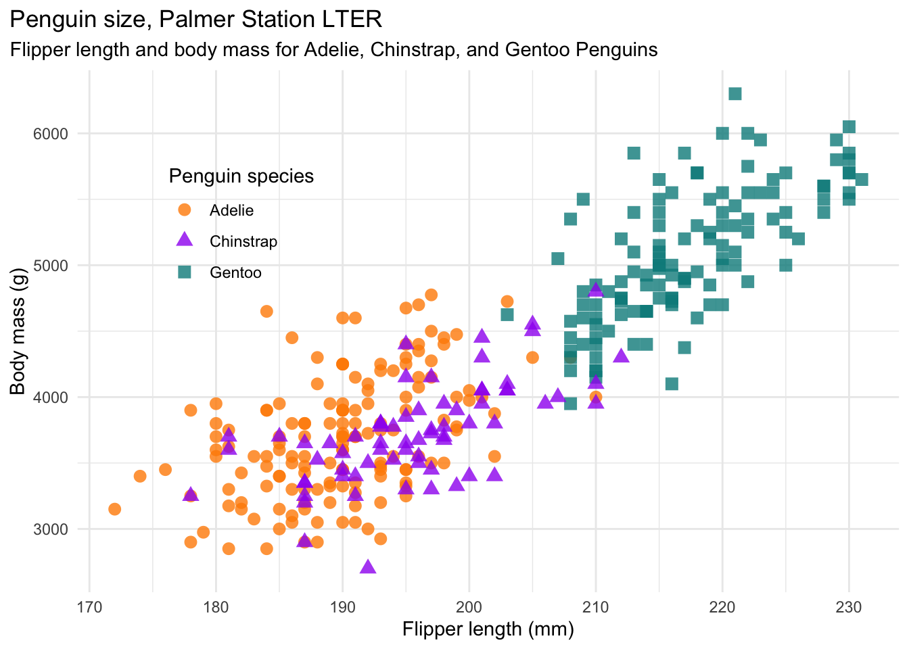

# Data Visualization Agent

# Description
A command line implementation of an AI agent that produces data visualizations and/or data transformations from user dataset and user natural language prompt input. 

The AI agent is called from the command line and users can input a description of a figure (e.g. a plot, chart, graph) or data transformation that they want to be produced from a dataset of their choosing. The path and dataset file are then inputted. The agent generates and executes the python code to construct the figure or the updated transformed dataset file. 

The goal of building this command line data visualization agent was to develop a proof of concept prototype for future devlopment into a production ready tool for users with little to no programming abilities to use. This command line agent also serves as a building block for the development of other agents for mutiple use cases. 

# Usage
## Installation
The agent will be called from a python script and has a few dependencies. To intall the dependencies and obtain the agent script users can clone this repo and use the following commands to get started.   
```

# Current setup and examples files
git clone https://github.com/lpietan/Data-Vis-Agent-CL.git

cd Data-Vis-Agent-CL

# Install dependencies
pip install -r requirements.txt

```

## Together AI Key and Model
The agent uses a model hosted by Together AI (https://www.together.ai). To have access to the model, users will need to generate their own Together AI API key. If users already have a user key, they can move onto the next step ([Configuration and Input](#Configuration-and-Input)). If users do not already have a user key, they will need to create a Together AI account and generate one at the following link.

https://api.together.ai/signin

Once users have created and setup their account, the API key will be generated.

## Configuration and Input
Set the together API key.
```
export TOGETHER_API_KEY=""
```
Run the agent script.
```
python dataset_agent.py
```
Users will be prompted with the following.
```
Enter your data visualization/manipulation request (or 'q' to quit): 
```
Users can describe here the figure or data trasformation that they would like from the data. Then the user will be prompted for a path to the dataset file.
```
Enter the path to the dataset file: 
```

## Output
Once a file is inputted, the agent will generate and execute a python script. There is some error management that will guide troubleshooting. Expected output from the agent when running successfully will have print statements of progress when generating and executing the code as well as from the generated script. The agent will return a success statement and there will be at least two ouput files. There will always be a code file output `generated_code.py` and a figure output file `output_plot.png` or a transformed data output file `transformed_data.csv` or both depending on the user prompt. It is possible to guide the output with the user prompt to have a custom output file names or file types. 

## Example Dataset
Included in the repo is the Palmer Penguins dataset for testing the agent and its capabilities. Informaion on the Palmer Penguins dataset can be found at the following.

https://github.com/allisonhorst/palmerpenguins

Horst AM, Hill AP, Gorman KB (2020). palmerpenguins: Palmer
Archipelago (Antarctica) penguin data. R package version 0.1.0.
https://allisonhorst.github.io/palmerpenguins/. doi:10.5281/zenodo.3960218.

# Results and Examples
The following are examples of prompts that have a yielded results that replicate figures that are published with the Palmer Penguins dataset on their GitHub page (https://github.com/allisonhorst/palmerpenguins). 


Prompt: "Produce a figure that plots flipper length on the X and bill length on the Y and have each species be a different color and shape for the data points with the key in the bottom right corner. Include a best fit line for each species."

Agent Figure


Published Figure

 


Prompt: "Produce a figure that plots flipper length on the X and body mass on the Y and have each species be a different color and shape for the data points with the key in the top left corner."

Agent Figure


Published Figure




Prompt: "Plot overlapping histograms of flipper lengths for each species using different colors and transparency in case of overlap. Use a bin size of 2 mm. As an example for values to include in bins, I want values = 190 to be included in the 188-190 bin.  The Y axis should be Frequency. Each species should be plotted with a separate label to allow for a legend. Place the legend to the right side of the plot. Bin values should include the upper edge."

Agent Figure


Published Figure


# Details
## LLM
This agent is currently using the Meta Llama 3.3 70B Instruct Turbo Free model. This is a limited free model that is great for prototyping and testing at low cost. With this limitied free chat model, that is not optimized for code output, we are still able to generate executable code that produces the desired figures and datasets that were prompted. There is potential to increase functionality of the agent or produce more elaborate figures and/or dataset transformations with a larger and/or code optimized model.

## Security
With using large language models (LLMs) to generate code and run the code generated with no oversight step, there is a risk. Within the agent, we have included some checks that are performed on the generated code before it is executed. This should be enough for the purpose of this agent and repo. However, the overall goal of this repo is to be a building block for a potential production tool to be used by several users in an organization. If this were the case additional security steps may need to be considered.

